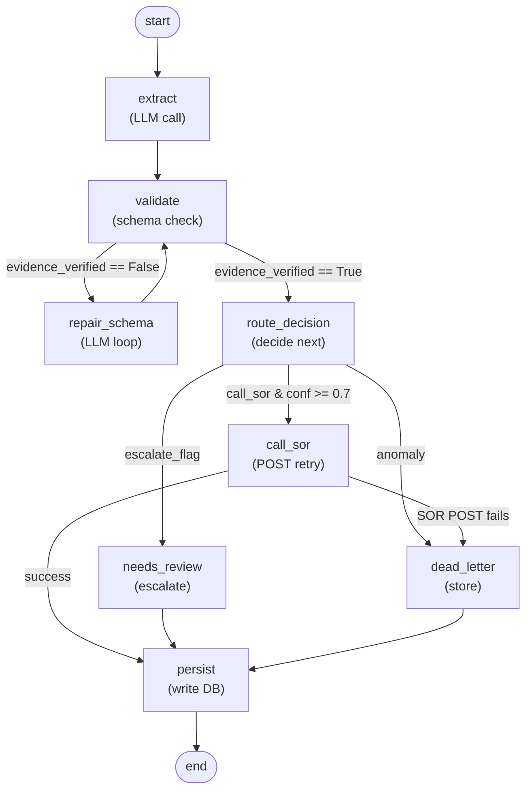

# Architecture

## 1. Components

```
┌─────────────────┐
│    HTTP Caller  │
│  (smoke_http.py)│
└────────┬────────┘
         │ POST /agent/extract
         │
    ┌────▼─────────────────────────────┐
    │   FastAPI :8000                  │
    │  (src/api/main.py)               │
    └────┬─────────────────────────────┘
         │ invoke()
         │
    ┌────▼─────────────────────────────┐
    │   LangGraph StateGraph           │
    │  (src/agent/graph.py)            │
    │   9 nodes, 3 conditional edges   │
    └────┬──────┬──────┬───────────────┘
         │      │      │
         │      │      └──────┐
         │      │             │ POST /contracts
         │      │             │ (tenacity retry)
    ┌────▼──────▼─────────────▼────┐
    │   SQLite :db                 │
    │  runs / stage_events /       │
    │  artifacts / dead_letter     │
    └──────────────────────────────┘

    ┌──────────────────────┐
    │   Mock SOR :8001     │
    │  (src/api/sor.py)    │
    │  POST /contracts     │
    └──────────────────────┘
```

## 2. LangGraph Node Diagram



## 3. Per-Node Walkthrough

| # | Node | Reads | Writes | Failure Mode |
|---|------|-------|--------|--------------|
| 1 | `extract` | `text` | `extracted_fields`, `self_llm_confidence` | LLM timeout; invoke tenacity retry 3x. |
| 2 | `validate` | `extracted_fields`, schema | `evidence_verified`, `validation_errors` | Schema mismatch stored; routes to repair or route. |
| 3 | `repair_schema` | `validation_errors`, `text` | `extracted_fields` (updated) | Loop limit (3) triggers dead_letter. |
| 4 | `route_decision` | `self_llm_confidence`, `extracted_fields` | `review_reasons`, `sor_decision` | LLM fail-safe: default to needs_review. |
| 5 | `call_sor` | `extracted_fields`, `trace_id` | `sor_id`, `sor_response` | POST fail (5xx) → dead_letter; 4xx → skip (error logged). |
| 6 | `needs_review` | state | `status='needs_review'` | Not a failure; escalation by design. |
| 7 | `dead_letter` | state, reason | `status='dead_letter'` | Not a failure; safe harbor for anomalies. |
| 8 | `persist` | all state | `status`, SQLite writes | DB write fail halts; raises exception (no fallback). |
| 9 | `end` | final state | — | Returns response to caller. |

## 4. State (AgentState TypedDict)

| Field | Type | Set By | Notes |
|-------|------|--------|-------|
| `document_id` | str | caller | Unique doc identifier (e.g., "http_msa"). |
| `text` | str | caller | Raw contract text. |
| `hint` | str | caller | Optional routing hint (e.g., "contract:msa"). |
| `trace_id` | str | `extract` | UUID; single PK across all surfaces. |
| `extracted_fields` | dict | `extract`, `repair` | LLM-extracted JSON fields. |
| `self_llm_confidence` | float | `extract`, `route` | LLM's self-assessed confidence (0–1). |
| `self_overall_confidence` | float | `route` | Fused confidence: 0.6×det + 0.4×llm − penalties. |
| `evidence_verified` | bool | `validate` | Citation substrings found in text. |
| `validation_errors` | list | `validate` | Schema violations (if any). |
| `review_reasons` | list | `route` | LLM-provided escalation rationale. |
| `sor_decision` | str | `route` | "call_sor" \| "escalate" \| "skip". |
| `sor_id` | str \| None | `call_sor` | SOR-assigned ID (null if not posted). |
| `status` | str | `needs_review`, `dead_letter`, `persist` | "extracted_result" \| "needs_review" \| "dead_letter". |
| `artifacts` | dict | `persist` | Final result JSON for DB storage. |
| `error_reason` | str \| None | any node | Fail message if status != extracted_result. |

## 5. Schemas

| Schema File | Location | Used By |
|-------------|----------|---------|
| `scenario2_contract_extraction_schema.json` | `../materials/schemas/` | `validate` (node 2), `repair` (node 3), `validation.py` schema-repair loop. |
| `agent_run_result_schema.json` | `../materials/schemas/` | `persist` (node 8) soft-validation; `src/api/main.py` response JSON-Schema check. |

Both schemas are **reused as-is**, not redefined. `jsonschema.validate()` is called directly on the schema object.

## 6. Confidence Computation

| Layer | File | Produces |
|-------|------|----------|
| **Deterministic** | `src/confidence.py` | Schema match score (0–1): required fields present, no extra fields. |
| **LLM-based** | `src/agent/graph.py` (node: extract, route) | `self_llm_confidence` (LLM emits 0–1 in reasoning). |
| **Fused** | `src/confidence.py` (`fuse_confidence()`) | `self_overall_confidence` = 0.6 × det + 0.4 × llm − Σpenalties. |
| **Penalties** | `src/confidence.py` | −0.15 for missing required field, −0.10 for unverified citation, −0.05 per schema error. |

Router threshold: ≥0.7 → `call_sor`; <0.7 → `needs_review`.

## 7. Three-Branch Routing

After `route_decision` (node 4), the agent chooses one of three branches:

1. **`call_sor`** — Conditions: `self_overall_confidence >= 0.7` AND `evidence_verified == True` AND `sor_decision == "call_sor"`. Agent POSTs extraction to SOR with tenacity (3× retry, 5xx-only, exponential backoff). On success, → `persist`. On SOR failure, → `dead_letter`.

2. **`needs_review`** — Conditions: `self_overall_confidence < 0.7` OR `evidence_verified == False` OR explicit `review_reasons` list from LLM. Agent stores state in `stage_events` marked "escalated"; bypasses SOR. → `persist` (status='needs_review').

3. **`dead_letter`** — Conditions: `sor_decision == "skip"`, SOR POST fails after retries, or repair loop exceeds 3 attempts. Agent writes anomaly + reason to `dead_letter` table. → `persist` (status='dead_letter'). Replay via POST `/dead-letter/{trace_id}/replay`.

See [src/routing.py](src/routing.py) for threshold values.

## 8. Reliability

**Retry Policy** (tenacity):
- 3 total attempts.
- Exponential backoff: 1s, 2s, 4s.
- Trigger: 5xx HTTP status only (4xx failures bypass retry, logged as SOR-side error).
- Fallback: After 3 fails, route to `dead_letter`.

**Dead-Letter Table Schema**:
```sql
CREATE TABLE dead_letter (
  trace_id TEXT PRIMARY KEY,
  document_id TEXT,
  reason TEXT,
  text_preview TEXT,
  created_at DATETIME,
  updated_at DATETIME,
  replay_count INT DEFAULT 0
)
```

**Replay Semantics**:
- Read-only: Replay does NOT delete or modify the DLQ entry.
- POST `/dead-letter/{trace_id}/replay` returns a *new* `trace_id` for the retry run.
- Use case: Manual fix of LLM prompt, then replay entire trace.

## 9. Observability

All three artifacts are keyed by a single `trace_id` (UUID):

1. **JSONL trace** (`solution/traces/{trace_id}.jsonl`):
   - Line-delimited JSON events: `{timestamp, stage, node, fields, result, error}`.
   - Written by `src/tracing.py` after each node execution.
   - Readable for audit & debugging.

2. **SQLite stage_events table**:
   - Row per node transition: `trace_id, node_name, status, fields_snapshot, created_at`.
   - Queried via GET `/runs/{trace_id}/events`.

3. **Artifacts table** (extracted results):
   - Row per run: `trace_id, document_id, extracted_json, sor_id, confidence, status, created_at`.
   - Queried via GET `/runs/{trace_id}`.

HTTP response includes `trace_id` in all endpoints. Caller can then GET `/runs/{trace_id}` to check status, or GET `/runs/{trace_id}/events` to trace execution flow.

## 10. Test Surface

| Test File | Coverage |
|-----------|----------|
| `tests/test_graph.py` | Node execution, state transitions, conditional edge logic. Mocks LLM & SOR. |
| `tests/test_pipeline.py` | End-to-end: extract → validate → route → call_sor (mocked) → persist. 4 scenarios: happy MSA, happy subscription, needs_review NDA, dead_letter poison. |

All tests use MockLLM (`src/llm/mock_client.py`) and MockSOR (in-process stub). Run:
```bash
python -m unittest discover -s tests -v
```
Expected: 8 tests pass, full coverage of graph branching & schema validation.
